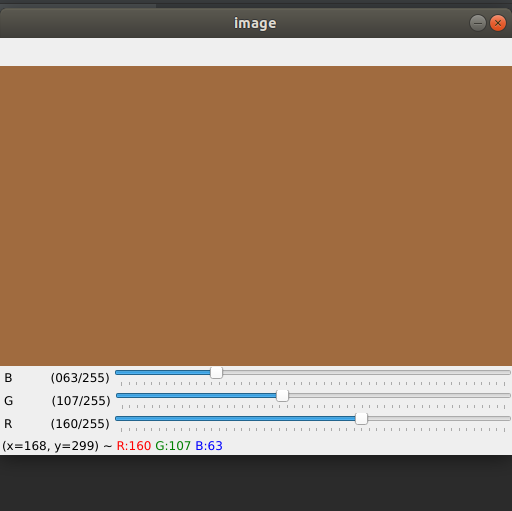
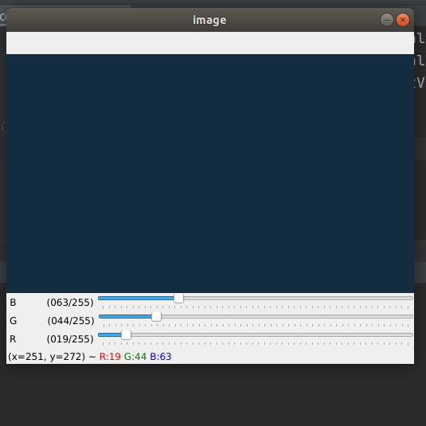

# OpenCV-BGR-Color-Generation

This is a basic OpenCV project in which user can generate a custom color with the help of 3 trackbars. Each trackbar will represent one of the three components. Any color can be generated by altering the BGR value using trackbars.

## Example 1

## Example 2

